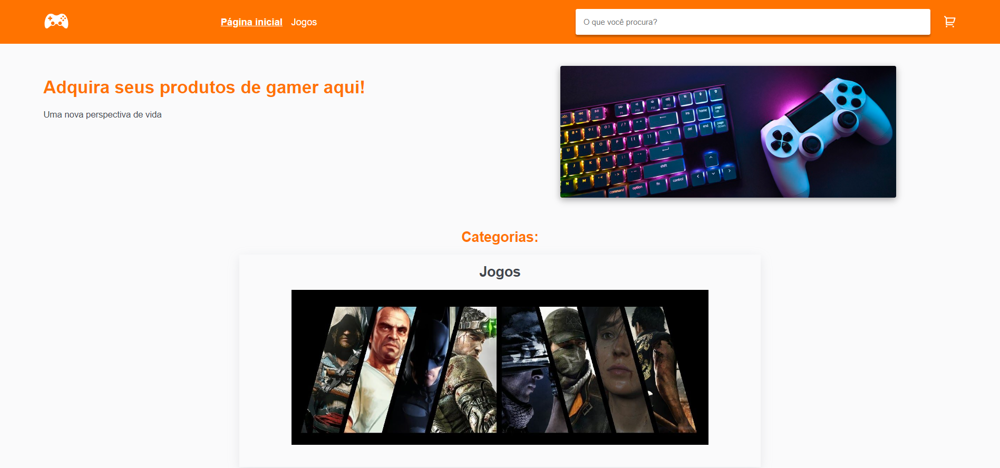
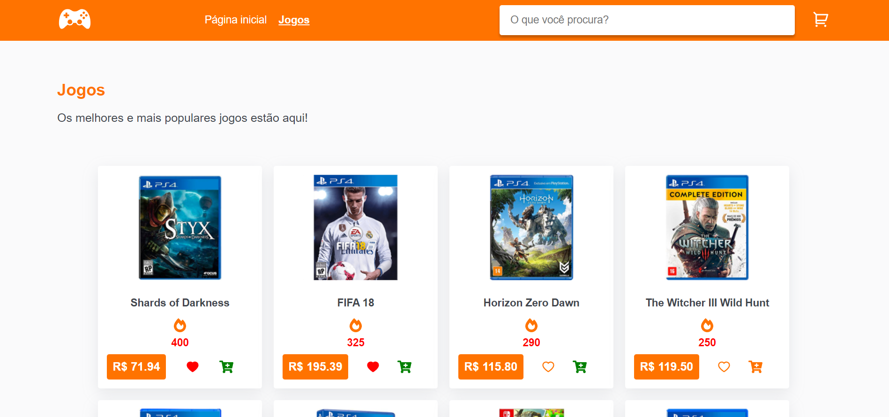
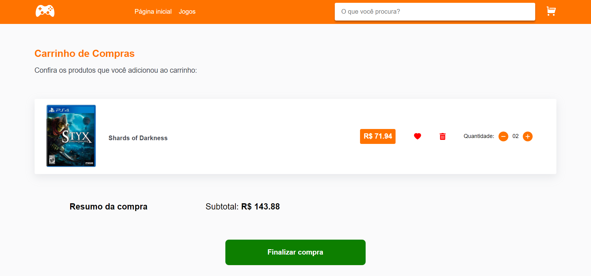

# Interface de loja para produtos de jogos
Projeto feito como desafio.

## Como rodar passpo a passo:
1. Clone o projeto com `git clone https://github.com/prince-neres/gaming-e-commerce-interface.git`
2. Entre no diretório do projeto com `cd gaming-e-commerce-interface `

### Com NPM ou Yarn
1. `npm i` ou `yarn`
2. `npm start` ou `yarn start`

### Com Docker
1. `docker-compose up`

## Preview:
<h3 align="center">Página incial</h3>

  

<h3 align="center">Produtos</h3>

  

<h3 align="center">Carrinho de compras</h3>

  

 

## Tecnologias utilizadas:
* [React.js](https://pt-br.reactjs.org/)
* [SASS](https://sass-lang.com/)
* [React Icons](https://react-icons.github.io/react-icons/)
* [React Router DOM](https://reactrouter.com/en/main/start/overview)
* [Redux](https://redux.js.org/)
* [Redux Toolkit](https://redux-toolkit.js.org/)
